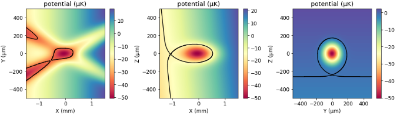

# Heliumtools 
[](https://opensource.org/licenses/MIT)


This package is developped by the [Quantum Atom Optics]((https://www.lcf.institutoptique.fr/groupes-de-recherche/gaz-quantiques/experiences/quantum-atom-optics)) group at the  Laboratoire Charles Fabry, [Institut d'Optique Graduate School](https://www.institutoptique.fr/) in Palaiseau (France). 

We make use of Bose-Einstein condensates (BEC) of metastable helium atom (He*) to perform interferometry experiments inspired by quantum optics. A remarkable feature of the metastable state of helium is its very large internal energy (20eV), allowing the use of a single-atom resolved detector, based on the electron amplification. This detector is called a microchannel plate (MCP) and provides three-dimensional data in the momentum space of the atoms. This python package gathers code we daily use to analyze our datas. 

**Contributors**

* [Alexandre Dareau](https://github.com/adareau)
* [Quentin Marolleau](https://github.com/quentinmarolleau)
* [Charlie Leprince](https://github.com/charlieleprince)
* [Victor Gondret](https://github.com/QuantumVictor)
* [Clothilde Lamirault](https://gitlab.in2p3.fr/clothilde.lamirault)
* [Paul Paquiez](https://github.com/PaquiezPaul)

## Installation
This package can be installed on any OS : it was successfully run on Linux and Windows but not not yet tested on Mac (but it should be OK).\
This package was written in Python 3.9, so we recommend using it with Python 3.9 or newer versions. Of course, we strongly recommand the use of python environnements. 

Clone the project and installing with pip. Install then PyTorch manually. For most computers, the command lines to install the package are the following. 

```
source path.to.your/python/env/bin/activate
git clone git@gitlab.in2p3.fr:gaz-quantiques-lcf/helium-1/heliumtools.git
cd heliumtools
pip install -e .
pip install torch --index-url https://download.pytorch.org/whl/cpu
```
Please go to [the detailed installation procedure](manual_doc/installation.md) for more details.
<!-- 
- Create a new environment (heliumenv here for example). We use mkvirtualenv.

    - `mkvirtualenv -p /usr/bin/python3.9 heliumenv`
    - If it is not done, add this shortcut to your path bashrc: `gedit ~/.bashrc` and paste:

        ```bash
        export WORKON_HOME=$HOME/.virtualenvs
        export PROJECT_HOME=$HOME/Devel
        source /usr/share/virtualenvwrapper/virtualenvwrapper.sh
        ```

- Clone the heliumtools repository and pip install it `cd /your/path/heliumtools && pip install -e .`
- Since March 2023, we use PyTorch to compute correlations. We add trouble to install it through pip but one can install it using `pip3 install torch torchvision torchaudio --index-url https://download.pytorch.org/whl/cpu` -->

## Available modules
### Tools : the ROI format
 
 

We defined in this module the Region of Interest selection that is widely use in all programs. Documentation is available [here](manual_doc/tools.md). A ROI must be a dictionary whose each entry can be of the following form :
* a dictionary of the form {"min": *float*, "max":*float*},
* a dictionary of the form {"position": *float*, "size":*float*},
* a list or tuple with the minimum and maximum.

For example :  `ROI = {"Vx":[-15,15], "Vy":{"position":0, "size":20}}` is a correct ROI.
### Gather data
 
 
 

This module defines the function that we use to gather datas from our experiment folder. The documenation is available [here](manual_doc/gather_data.md).

### Data builder
 
 


This class is the mother class of all our code : since we are performing time of flight experiment, the position that we measure can be interpreted in terms of *in-trap momentum*. This class transforms the (X,Y,T) position and impact times of atoms to (Vx, Vy, Vz) speeds in mm/s.

### Dataset
 
 
 

The idea of this class is to store in a file all the parameters required to perform correlation codes without executing the entire notebook in a well (or not that well) defined order. The example notebook is available [here](heliumtools/exemples/dataset.ipynb).


### Momentum resolved correlations : the correlations module
 
 
 

An example notebook is available [here](heliumtools/exemples/correlations.ipynb). This code is always under developpement and one should check the latest pair sequence on laboratory notebook to get up-to-date notebook.


### Momentum integrated correlations : the correlations2 module
 
 
 

This module ables one to probe integrated correlations. See [the module documentation](manual_doc/correlations2.md) for more informations. This code is always under developpement and one should check the latest pair sequence on laboratory notebook to get up-to-date notebook.
<div style="text-align: center;">
    
</div>

### Atom 
 
 
 

This module implements the intrasec atomic properties of different atoms. As we only work with Helium4, we only defined this atom. This module is mostly used within the ODT-calc module. 


### ODT-calc : trap properties calculations
 
 
 

This module analyzes cold-atom traps combining (far off-resonant) laser beams and (circular) magnetic coils. It was first developped by [Alexandre Dareau](https://github.com/adareau) in the [odt-calc package](https://github.com/adareau/odt-calc) but was forked and implemented into the heliumtools package in 2022. 

**Jupyter Notebooks Examples**
* [The odt-calc example notebook](heliumtools/exemples/odtcalc_examples.ipynb) 
* [Helium coils notebook](heliumtools/exemples/odt-calc-coils-manip-helium.ipynb) describes and uses the specific class on which we implemented our cloverleaf Ioffe-Pritchard like magnetical trap.

<div style="text-align: center;">
    
</div>

*This image shows the analysis that can be carried by the odt-calc module. It is possible to model laser beams and magnetic coils.*
### Fits
 
 
 

The default fit class of [HAL](https://github.com/adareau/HAL) was copied and pasted in the heliumtools repository so that any user is not compelled to recode a fit function.  Check the [documentation](manual_doc/fit.md) for more informations.
```python
from heliumtools.fit.dampedoscillation import DampedOscillation1DFit
fit = DampedOscillation1DFit(x = x_data, z = z_data)
fit.do_guess()  # guess data
fit.do_fit()
print(fit.popt, fit.perr)
```

### Lattice 
 
 
 


<!-- Here we gather useful code that we use daily in the lab. 
One will recover:
- Correlations: is the code we use to check whether or not atomic pairs are correlated,
- Odt-calc: is the code we use to check properties of our optical dipole trap or magnetic trap,
- Bragg: this class enables the user to compute reflectivity profiles to set up our Bragg pulses. -->


## Credits

This package was created with [Cookiecutter](https://github.com/audreyr/cookiecutter) and the [`audreyr/cookiecutter-pypackage`](https://github.com/audreyr/cookiecutter-pypackage) project template.
