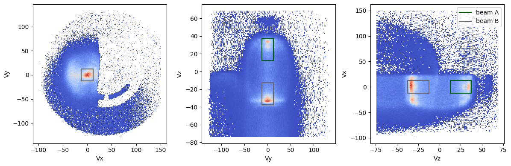
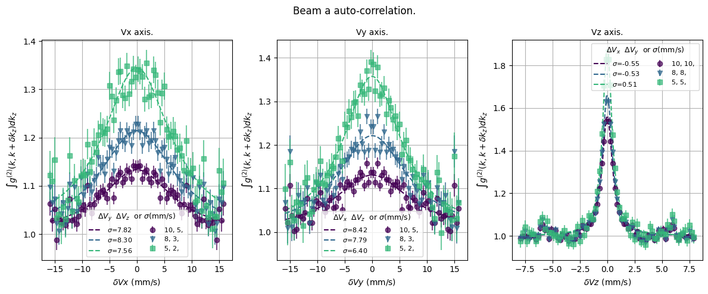

# correlations2 - momentum integrated correlations

Instead of putting atoms in boxes and then correlating these boxes, we will calculate the differences of all pairs of atoms per cycle and count the number of pairs of atoms whose velocity differences are within each small 3D box (voxel). The program's execution time is on the order of 30-100 seconds.

### Quantities to define
The first step of the code is therefore to build this `voxel_map`. The user is thus asked to define:
* the size of voxels in the `voxel_size` dictionary
* the number of voxels in the voxel_numbers dictionary
Note that the voxel map is systematically centered on 0.
We will also define two beams (following [Raphael Lopes'](https://theses.fr/2015IOTA0001) terminology), corresponding to the atom beams of pair 1 and 2.
We also have a few other quantities to define:
* `ref_frame_speed`: reference frame in which we place ourselves (center of mass of the two beams)
* `only_one_beam`: boolean, if we want only one or two beams (improves the speed of the code by a factor of 3). If True, then we only calculate local correlations.
* `ROI`: region of interest. As usual
* `computer_performance`: integer, the larger it is, the larger the computer memory used should be. It is explained below that we loop over cycles. If this integer is greater than 1, we will do len(cycles) / computer_performances iterations so it can improve the speed of the program.


<div style="text-align: center;">
    
</div>

*On the image abve, the user defined the two beams A and B. Dataset obtained on June 22nd, 2022.*

The program then calculates the autocorrelation of each beam and the autocorrelation between beam A and B. A naive version of the program to calculate the cross-correlation would be:

```
G2 = get_voxel_map()
for ncycle in [1, 2, ... N]:
    for atom1 in beam1:
        for atom2 in beam2:
            δ = atom1.speed - atom2.speed
            G2_crossed[δx, δy, δz] += 1
```
### How the code works
In the code, we loop over the cycles and at each cycle, we calculate:
* `G2AA`: voxel map of the autocorrelation of beam A,
* `G2AA_rand`: voxel map of the autocorrelation of beam A randomized (for normalization). 
* Similarly: `G2BB` and `G2BB_rand`.
* `G2_AB`: cross-correlation between beam A and beam B (also with `G2AB_random`).
  
To retrieve the voxel maps of each local/cross correlation, we use the `get_G2` method which takes as arguments:
* `atX`: array (pandas) with the velocity of each atom Vx, Vy, Vz, its cycle, and a unique number per atom (index). atX is designed to be the set of atoms in beam X at cycle i. This unique number avoids counting when we have the same atom (the operator $a^\dagger a^\dagger aa$ destroys two atoms so if it's the same atom, it equals 0).
* `atY`: pandas array similar to atX. For a local correlation, X=Y.
* `local`: boolean. If `local=True`, then we calculate $V_{(x, y z)}^A - V_{(x, y z)}^B$ whereas if `local=False`, we calculate the sum of the two velocities.


<div style="text-align: center;">
    
</div>

*The above image represent the normalized second order correlation function $g^{(2)}(k_x, k_y, k_z)$ along each direction : left is along $k_x$, middle along $k_y$ and left is along $k_z$.* 