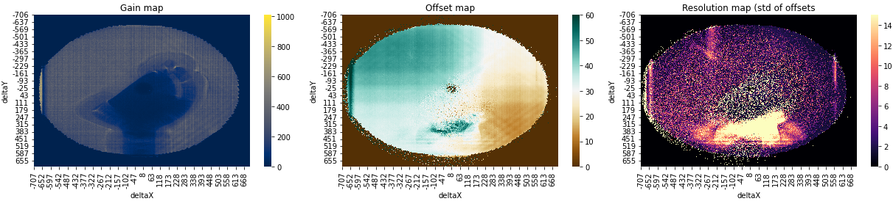
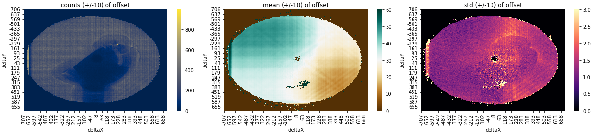

# MCP offset map
This class was written in 2022 when we aquired MOT onto the MCP to establish a new offset map. 

    
       

*The images above represent te gain map (left) offset map, (middle) and resolution map (right). The first raw was computed using all reconstructed atoms while the second chose atoms whose offset deviation was not too high (smaller than 10 time steps). See the laboratory Notebook on July, 18th of 2022 for a detailed exmplanation of this choice.*

### Adding Sequences to the Database

The principle of the code is as follows: we iterate through each .atoms file of the sequence given as an argument to the `add_sequence_to_database` method and add the deltaX and deltaY positions of each atom, along with its offset, to a database named `offsets.db` (SQLite) located in the directory provided as an argument when initializing the class (here `/home/victor/mcpmaps/`).
If these sequences have already been added to the database, we do not add them again (otherwise we risk counting the same atom multiple times).

Typically, adding a thousand cycles takes about thirty seconds.

### Calculating Statistical Properties of the MCP

Once the sequences have been added to the database, we want to calculate the statistical properties of each pixel of the MCP. For this, we need to load the entire database and calculate the mean value, offset, etc. of each pixel.
This can depend on the computer used, but it can be very large and therefore not computable in one go.

To do these calculations little by little, we will loop over the different values of deltaX, which correspond to the pixels along the X axis of the MCP.
Note: deltaX = `[-707 -706 .....705 706 707]`.

The first method was to loop individually over each deltaX value, but this is very slow because it requires 1500 iterations and querying the database 1500 times (this step is then limiting). The loaded file is not very important and we do not optimize the computer's capabilities.

So I chose to load several values of deltaX at once, for example 10 at a time, and work with these 10 values `[-707 -706 .... -698]`. In order to choose the value that seems most suitable, you can call the `check_your_computer_ability(size)` method where size is precisely the number of deltaX values (10 in the example above). The larger your computer's RAM, the larger size you can afford.

Once this parameter has been chosen, it can be set by calling `set_computer_ability(size)` to fix it. Finally, you can start the calculation by launching the `update_result()` method.

This method took 40 minutes to execute on my computer with a size of 30 ( i5 processor of 2009 with 12 Go RAM computer).

### Content of the result dataframe

Congratulations! You have just generated the result dataframe which contains all the interesting data for analyzing our MCP. Let's take a moment to look at its rows and columns.

Each row corresponds to a pixel of the MCP, located by its deltaX and deltaY position.

For each pixel, we then have:
* `counts`: the number of hits, aka the total number of detected atoms.
* `mean`: the mean of the offsets.
* `std`: the standard deviation of the offset series.
* `max`: the maximum of each measured offset.
* `min`: well okay, you guessed it.
* `quantile 5`, `quantile 95`, `quantile 25`, `quantile 75`: the offset value below which 5% of the values lie (respectively 95%, 25%, and 75%).
* `mean (90)` & `std (90)`: the mean and standard deviation for the offset series between the 1st decile and the 9th decile.
* `mean (50)` & `std (50)`: the mean and standard deviation for the offset series of the two central quartiles.
* `mean (+/-10)`, `counts (+/-10)` & `std (+/-10)`: which are the mean, the hit count, and the std of the offset series whose values are between median(offsets)+/-10 time units.
* `mean (+/-10)`, `counts (+/-10)` & `std (+/-10)`: the same as above with 5 time units.

## Visualization of MCP Maps

The class has some naive methods to look at the offset maps, but it will probably be simpler to write them yourself. The existing ones are as follows:
* `show_map(column, **kwarg)`: takes a column of the result dataframe as argument. Any other argument is passed to the seaborn heatmap object. To visualize a map of:
  * gain: `column = counts`
  * offset: `column = mean`
  * resolution: `column = std`
  etc...
* `show_three_maps(**kwargs)`: shows gain, offset, and resolution maps. Any argument given is passed to seaborn.heatmap for the 3 maps.
* `show_three_detectivity_maps(**kwargs)`: shows the 3 detectivity maps. The first represents the standard deviation of the offset distribution for each pixel, the second the standard deviation of the central 8 deciles of the offset distribution, and the last the two central quartiles. I advise passing the argument `vmin = 0, vmax = 10`.
* `show_three_offset_maps(**kwargs)`: shows the 3 offset maps. The first represents the standard mean of the offset distribution for each pixel, the second represents that of the central 8 deciles of the offset distribution, and the last represents the mean of the two central quartiles. I advise passing the argument `vmin = 0, vmax = 60`.
* `show_offset_distribution(points, **kwargs)`: shows the offset distribution of the given points. `points` is therefore a list of tuples (deltaX, deltaY).
⚠️ This command takes time (a few minutes) because it will query the database as many times as there are points.
Example: `points = [(300, 300), (-150, 150)]`
